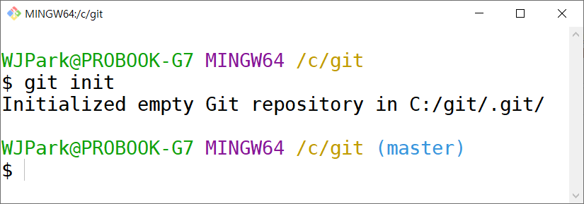
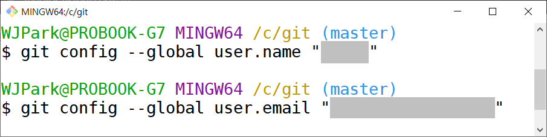
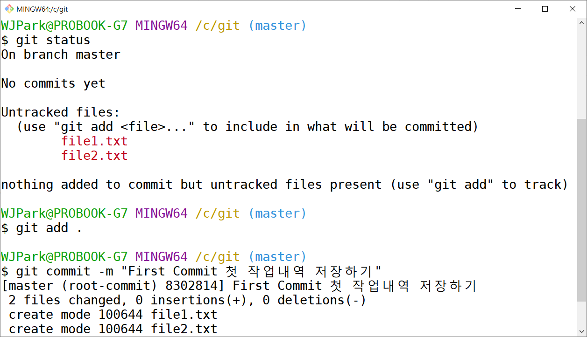
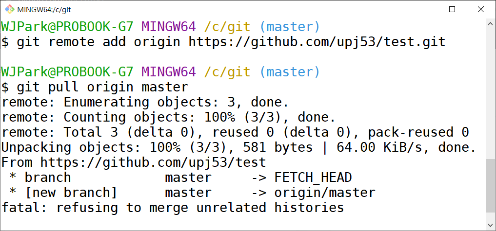
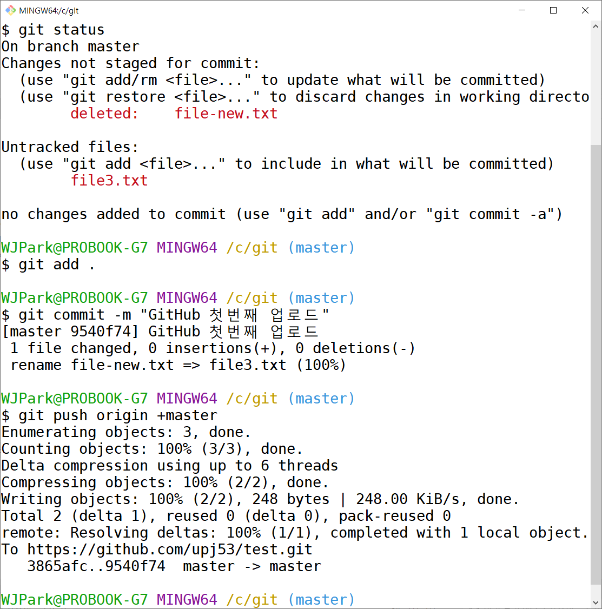
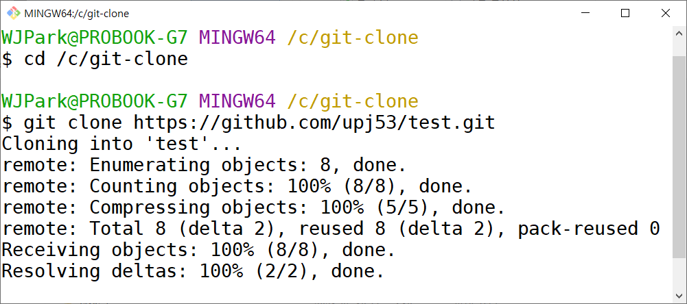

# 깃(Git)이란 무엇인가?
  + [깃(위키백과)](https://ko.wikipedia.org/wiki/%EA%B9%83_(%EC%86%8C%ED%94%84%ED%8A%B8%EC%9B%A8%EC%96%B4))
  + [Git 홈페이지](https://git-scm.com)
  + [Git 오픈튜토리얼](https://opentutorials.org/module/155/2475)
# 준비물
  + [깃(Git) 다운로드와 설치](https://git-scm.com/downloads)
  + [소스트리(SourceTree) 다운로드와 설치](https://www.sourcetreeapp.com)  
※ 모든 설치는 기본 설정으로 합니다.
# 깃 명령어 (기본)
## 1. 내 컴퓨터에서 초기화 하기
+ git init  
내 컴퓨터의 작업 폴더로 이동한 후 해당 폴더를 git 이 관리할 수 있게 등록 및 초기화 합니다.
```
C 드라이브의 git 폴더가 작업폴더 일 때
> cd /c/git/
> git init
```


+ 사용자 아이디와 이메일 등록  
git 작업 폴더에서 사용할 아이디와 이메일 등의 환경설정을 저장합니다.  
이때 git config 명령어를 사용합니다.
```
사용자 이름 등록
> git config --global user.name "아이디입력"

사용자 이메일 등록
> git config --global user.email "이메일주소입력"
```


## 2. 작업내역 저장하기 : git commit
git은 버전을 관리하는 프로그램으로 소스코드의 작업내역을 저장합니다. 포토샵과 엑셀과 같은 유틸리티의 History 저장 기능과 비슷하지만 훨씬 더 강력하고 유연한 기능을 가지고 있습니다.  
  
작업내역을 저장하기 위해서는 다음 2 단계를 거칩니다.  
  
첫째,  변경된 소스코드를 타임캡슐(Stage)에 넣습니다. → git add .  
둘째,  타입캡슐에 소스코드를 다 넣었으면 이름표(Message)를 달아서 저장합니다. → git commit -m "이름표 Message"

```
준비, 소스코드 현재 상태를 확인합니다.
> git status

첫째, git add .
현재 폴더의 모든 파일을 타임캡슐(Stage)에 넣습니다.
이때 git init을 실행했던 최상위 폴더에서 명령을 실행해야 합니다.
> git add .

둘째, git commit -m "이름표 Message"
현재 상태를 이름표(Message)를 달아서 저장합니다.
> git commit -m "이름표 Message"
```


## 3. 원격 저장소 활용하기 (GitHub 다운로드와 업로드)
다양한 원격 저장소가 있지만 GitHub를 예를 들어 설명합니다. GitHub 회원가입과 계정생성, 그리고 원격 저장소 만들기는 링크와 검색을 참고하세요. [GitHub](https://github.com), [Git인프런강의](https://www.inflearn.com/course/git-and-github)

### 3-1. 나의 원격 저장소 연결하고 다운로드 하기
+ 원격 저장소(repository) 연결하기  
이를 위해 원격저장소가 만들어져 있어야 합니다.
```
원격 저장소 연결하기
> git remote add origin 원격저장소링크

원격 저장소 파일 다운로드 받기
> git pull origin master
또는
> git pull origin main
※ 원격 저장소 설정에 따라 master 또는 main으로 변경합니다.
```


### 3-2. 나의 원격 저장소에 업로드 하기
소스코드의 작업내역을 commit으로 저장한 뒤 원격 저장소에 업로드 합니다.  
※주의! 이때 원격 저장소의 파일을 덮어쓰지 않게 조심하세요!!

```
소스코드 변경사항을 확인합니다. → git status
> git status

소스코드 변경사항을 타임캡슐(Stage)에 담습니다. → git add .
> git add .

변경된 타임캡슐에 이름표를 달고 저장합니다. → git commit -m "이름표 Message"
> git commit -m "이름표 Message"

원격 저장소에 업로드 합니다.
이때 +master 통해 기존 버전을 덮어쓰기 하여 업로드 합니다.
> git push origin +master
또는
> git push origin +main
```



### 3-3. 다른 사람의 원격 저장소 다운로드 하기
공개된 원격 저장소(repository)는 언제든지 다운로드 받을 수 있습니다. 이때 git clone 명령어를 사용합니다.
```
공개된 원격 저장소를 다운로드 받을 폴더로 이동합니다.
> cd /c/git-clone

원격 저장소를 복사(다운로드)합니다.
> git clone 원격저장소링크
```
